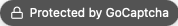

# 🛡️ GoCaptcha

Invisible + behavioral CAPTCHA for Go net/http apps (<del>works</del> Should work with any router, optional Gin usage).
It’s silent-by-default, adding small penalties for bot-like signals and hard-blocking only when the score crosses a
configurable threshold.

Badge preview (default style and text):



## Highlights

- Randomized hidden field (not named "honeypot")
- Timestamp + JS token + behavior tracking
- JS cookie check (js_captcha=enabled)
- Header/UA heuristics (detect headless/scripted clients)
- Per‑IP rate limiting
- SQLite logging with JSON reasons (for tuning and audits)
- Seeded spam keyword table + configurable Latin‑only enforcement
- OAuth callback bypass support (SkipPaths, SkipIf)
- Stats helpers (TopIPs, TopUserAgents, TopHours, HourlyCounts, TopReasons)
- Optional floating badge with lock icon

---

## Install

```bash
go get github.com/dragstor/gocaptcha
```

Import:

```go
import (
    "net/http"
    "time"

    "github.com/dragstor/gocaptcha"
)
```

## Go version support

- Minimum supported Go version: 1.20. The module's `go` directive is set to 1.20 to maximize compatibility while staying modern.
- Rationale: libraries should pin the minimum version they require, not the latest. This avoids breaking users on slightly older toolchains while still allowing everyone on newer Go versions to build and run.

---

## Quick start (net/http)

```go
cap := gocaptcha.New(gocaptcha.Config{
    ShowBadge:      true,                     // show small lock badge (optional)
    BadgeMessage:   "Protected by GoCaptcha", // badge text
    RateLimitTTL:   time.Minute,              // per-IP window
    RateLimitMax:   10,                       // max requests/window
    EnableStorage:  true,                     // enable SQLite logs + seeding
    DBPath:         "./captcha.db",           // defaults to ./captcha.db if empty
    BlockThreshold: -5,                       // block when score <= threshold
    // Bypass OAuth callbacks:
    SkipPaths: []string{"/auth/", "/oauth2/"},
    // Or a custom predicate:
    // SkipIf: func(r *http.Request) bool { return detectMyOauthCallback(r) },
})

http.HandleFunc("/register", func(w http.ResponseWriter, r *http.Request) {
    if r.Method == http.MethodPost {
        if cap.CheckRequest(r) {
            // Prefer "pretend success" to avoid leaking detection to bots.
            http.Redirect(w, r, "/thanks", http.StatusSeeOther)
            return
        }
        // Handle real registration here…
        w.Write([]byte("ok"))
        return
    }

    // Render the form (example uses raw HTML; templates recommended)
    honeypot := cap.HoneypotField()
    w.Header().Set("Content-Type", "text/html; charset=utf-8")
    _, _ = w.Write([]byte(`<!doctype html>
<html>
<head>
  <meta charset="utf-8" />
  <title>Register</title>
</head>
<body>
  <form method="POST">
    <input type="hidden" name="ts" id="ts" />
    <input type="hidden" name="js_token" id="js_token" />
    <input type="hidden" name="behavior_data" id="behavior_data" />
    <input type="text" name="` + honeypot + `" style="display:none" tabindex="-1" autocomplete="off" aria-hidden="true" />

    <input type="text" name="name" placeholder="Your name" />
    <input type="email" name="email" placeholder="you@example.com" />
    <textarea name="message" placeholder="Message"></textarea>
    <button type="submit">Submit</button>
  </form>
  <script src="/static/js/gocaptcha.js"></script>
  ` + cap.BadgeHTML() + `
</body>
</html>`))
})

http.ListenAndServe(":8080", nil)
```

Serve the JS file at /static/js/gocaptcha.js (see Frontend section).

---

## Gin usage (with templates or inline HTML)

GoCaptcha works with Gin by calling CheckRequest on POST. Important: the library does not and cannot inject HTML.
You must render the hidden inputs (or let the JS create them), include the JS file, and include the badge HTML
in your GET page/template.

```go
r := gin.Default()
cap := gocaptcha.New(gocaptcha.Config{
    ShowBadge:    true,
    BadgeMessage: "Protected by GoCaptcha",
    // ... other config
})

r.GET("/register", func(c *gin.Context) {
    honeypot := cap.HoneypotField()
    c.Header("Content-Type", "text/html; charset=utf-8")
    c.String(http.StatusOK, `<!doctype html>
<html>
<body>
  <form method="POST">
    <input type="hidden" name="ts" id="ts" />
    <input type="hidden" name="js_token" id="js_token" />
    <input type="hidden" name="behavior_data" id="behavior_data" />
    <input type="text" name="` + honeypot + `" style="display:none" tabindex="-1" autocomplete="off" aria-hidden="true" />
    <input type="text" name="name" placeholder="Your name" />
    <button type="submit">Submit</button>
  </form>
  <script src="/static/js/gocaptcha.js"></script>
  ` + cap.BadgeHTML() + `
</body>
</html>`)
})

r.POST("/register", func(c *gin.Context) {
    if cap.CheckRequest(c.Request) {
        c.Redirect(http.StatusSeeOther, "/thanks")
        return
    }
    c.String(http.StatusOK, "ok")
})
```

Note: cap.Middleware() returns a simple func(*http.Request) bool helper; call CheckRequest in your handlers as above.

---

## Frontend (static/js/gocaptcha.js)

Use the provided minimal script. It populates ts, js_token, behavior_data and sets the js_captcha cookie.

```html
<script src="/static/js/gocaptcha.js"></script>
```

File contents (already included in this repo at static/js/gocaptcha.js):

```js
(function () {
    // Always set the cookie to signal JS is enabled (even if form fields are missing)
    try {
        document.cookie = "js_captcha=enabled; Max-Age=31536000; Path=/; SameSite=Lax";
    } catch (e) {}

    // Helper to ensure a hidden input exists in a given form
    function ensureHidden(form, id) {
        let el = form.querySelector('#' + id);
        if (!el) {
            el = document.createElement('input');
            el.type = 'hidden';
            el.name = id;
            el.id = id;
            form.appendChild(el);
        }
        return el;
    }

    const forms = Array.from(document.querySelectorAll('form'));
    if (forms.length === 0) return;

    // Shared behavior events buffer
    const events = [];
    document.addEventListener('mousemove', e => {
        events.push({x: e.clientX, y: e.clientY, t: Date.now()});
    });
    document.addEventListener('keydown', () => {
        events.push({key: true, t: Date.now()});
    });
    document.addEventListener('click', () => {
        events.push({click: true, t: Date.now()});
    });

    // Initialize and wire up each form
    forms.forEach(form => {
        const tsField = ensureHidden(form, 'ts');
        const jsToken = ensureHidden(form, 'js_token');
        const behaviorField = ensureHidden(form, 'behavior_data');

        tsField.value = Date.now().toString();
        jsToken.value = 'set_by_js';

        form.addEventListener('submit', () => {
            try {
                behaviorField.value = btoa(JSON.stringify(events.slice(0, 100)));
            } catch (err) {}
        });
    });
})();
```

Note: Legacy files gocaptcha.js and js/gocaptcha.js are deprecated stubs. Use static/js/gocaptcha.js.

## Serving the JS file (Gin and net/http)

There are two ways to make the browser load the script:

- Option A — copy the file into your app’s public static directory and serve it as you already do. The file you need is at static/js/gocaptcha.js in this module.
- Option B — mount the embedded handler provided by this library (no copying required).

You can mount it under any URL prefix you like. If you already use Gin’s r.Static("/static", …) and it conflicts, prefer a different top‑level prefix like /static-js/.

net/http:

```go
// Mount under the default path
http.Handle("/static/js/", gocaptcha.JSHandlerWithPrefix("/static/js/"))
// then in your HTML: <script src="/static/js/gocaptcha.js"></script>

// Or mount under a custom path to avoid conflicts
http.Handle("/static-js/", gocaptcha.JSHandlerWithPrefix("/static-js/"))
// then in your HTML: <script src="/static-js/gocaptcha.js"></script>
```

Gin:

```go
// Default path
r.Any("/static/js/*filepath", gin.WrapH(gocaptcha.JSHandlerWithPrefix("/static/js/")))

// Custom path to avoid clashes with r.Static("/static", ...)
r.Any("/static-js/*filepath", gin.WrapH(gocaptcha.JSHandlerWithPrefix("/static-js/")))
// optionally also add HEAD if you prefer separate routes
```

Notes:
- Update the <script src> in your HTML to match the path you mounted.
- In Gin, if you insist on mounting under /static/js/ while also using r.Static("/static", ...), ensure the embedded handler route is registered before the broader static route, or just use a distinct prefix like /static-js/ to avoid routing ambiguity.

This simply serves the single file gocaptcha.js at whichever path you mount, e.g. /static/js/gocaptcha.js or /static-js/gocaptcha.js.

Tip: If you mount under "/static-js/", use <script src="/static-js/gocaptcha.js"></script>. The path "/static-js/js/gocaptcha.js" is not needed (and usually wrong). The handler also tolerates that variant for convenience, but it’s best to use the direct file path under your chosen prefix.

---

## Troubleshooting

- Badge not visible on your form even with ShowBadge = true:
  You must actually render the returned HTML by calling cap.BadgeHTML() in your page/template. Middleware cannot
  inject markup into your responses. Add something like: ` + "`" + `{{.CaptchaBadgeHTML}}` + "`" + ` (template) or concatenate
  ` + "`" + `cap.BadgeHTML()` + "`" + ` into your HTML string.

- Immediate redirects and logs show ["missing_ts","missing_js_token","behavior:missing_behavior","missing_js_cookie"]:
  This means the frontend integration is missing. Ensure that:
  - Your GET page includes <script src="/static/js/gocaptcha.js"></script> just before </body>.
  - Your form has hidden fields with ids ts, js_token, behavior_data (the script now auto-creates them if missing).
  - Cookies are allowed (js_captcha=enabled). If you’re testing on a very strict browser profile or with blocked cookies,
    the cookie check will add penalties.

- Using Gin or other routers:
  The middleware/helper only checks requests; it does not render the HTML. Add the script and badge HTML yourself in the
  GET handler or template as shown in the examples above.

---

## Real client IP behind reverse proxies (Caddy/Nginx/Cloudflare)

If your app runs behind a reverse proxy, r.RemoteAddr will typically be the proxy's IP (e.g., 127.0.0.1). To record and rate‑limit by the actual client IP, enable TrustProxyHeaders in the config:

```go
cap := gocaptcha.New(gocaptcha.Config{
    EnableStorage:     true,
    TrustProxyHeaders: true, // read Forwarded / X-Forwarded-For / X-Real-IP / CF-Connecting-IP
})
```

Notes:
- Only enable this when your app is behind a trusted proxy that sets those headers correctly. Do not expose your app directly to the internet with this flag on, otherwise clients could spoof their IP.
- Caddy and Nginx set X-Forwarded-For by default. Cloudflare sets CF-Connecting-IP.
- No other changes are necessary for Caddy in typical setups: the library will pick the left‑most valid IP from X-Forwarded-For.

---

## Configuration reference

Config fields (gocaptcha.Config):

- ShowBadge bool — render a floating badge via BadgeHTML()
- BadgeMessage string — text inside the badge
- RateLimitTTL time.Duration — per-IP window for rate limiting
- RateLimitMax int — max requests in the window before a small penalty
- EnableStorage bool — enable SQLite logs and automatic seeding
- DBPath string — path to SQLite db (defaults to captcha.db when empty)
- BlockThreshold int — block if score <= threshold (default -5)
- TrustProxyHeaders bool — when true, use real client IP from proxy headers (Forwarded, X-Forwarded-For, X-Real-IP, CF-Connecting-IP). Enable only when behind a trusted reverse proxy (e.g., Caddy/Nginx/Cloudflare).
- SkipPaths []string — path prefixes to bypass checks (e.g., "/auth/", "/oauth2/")
- SkipIf func(*http.Request) bool — custom bypass logic (e.g., OAuth callback detection)

Behavior overview:

- Hidden field: name returned by HoneypotField(); if filled, immediate block.
- Latin-only: when enabled (default), any non‑Latin letters in submitted text cause a hard block.
- JS/Timing: missing ts/js_token/behavior_data or too-fast submit penalized.
- Cookies/Headers: missing js_captcha cookie, suspicious UA, or missing headers add mild penalties.
- Content heuristics: URLs, spam keywords, emoji overuse, repeated punctuation, invalid email/URL, etc.
- Name validation: intelligent pattern detection catches bot-generated names (excessive consonants, random case mixing, suspicious vowel ratios, unrealistic length).

---

## Storage, seeding, and configuration (SQLite)

When EnableStorage is true, the library will create the database (if needed) and ensure these tables exist:

- captcha_logs(id, ip, ua, score, details JSON, timestamp)
- spam_keywords(id, keyword UNIQUE)
- captcha_config(key PRIMARY KEY, value)

Seeded defaults:

- captcha_config: latin_only = 1 (enabled), name_min_length = 2, name_max_length = 30, name_min_vowel_ratio = 0.15
- spam_keywords: a baseline set (e.g., earn, money, cash, crypto, bitcoin, forex, seo, backlink, guest post, sponsor,
  telegram, whatsapp, casino, bet, loan, payday, work from home, adult, porn, viagra, sex, xxx, escort, nft, investment,
  binary options, cheap, discount, limited offer, promo, marketing, followers, likes)

Change configuration:

```sql
-- Disable Latin-only enforcement
UPDATE captcha_config
SET value='0'
WHERE key = 'latin_only';
-- Or enable it again
UPDATE captcha_config
SET value='1'
WHERE key = 'latin_only';

-- Adjust name validation thresholds
UPDATE captcha_config SET value='3' WHERE key = 'name_min_length';  -- require 3+ chars
UPDATE captcha_config SET value='50' WHERE key = 'name_max_length'; -- allow longer names
UPDATE captcha_config SET value='0.10' WHERE key = 'name_min_vowel_ratio'; -- stricter vowel check
```

Add your own spam keywords:

```sql
INSERT OR IGNORE INTO spam_keywords(keyword)
VALUES ('a new scam'),
       ('free crypto'),
       ('backlink offer');
```

Note: If you previously created captcha_logs with a different schema, you may need to recreate it to include the details
column.

---

## Intelligent name validation

GoCaptcha automatically detects bot-generated names using pattern analysis. This catches automated registrations with random strings like `cBANbTZRkfyKusOGmKQgKK`, `rfdhgkhjl`, or `XddztxdMHikDFfQcyrM` without blocking legitimate international names.

**Detection methods:**

- **Vowel ratio analysis** — Flags names with unusually low (<15%) or high (>80%) vowel ratios
- **Excessive consonants** — Detects 3+ consecutive consonants (uncommon in real names)
- **Random case patterns** — Identifies mixed-case strings like `cBANbTZRkf` while allowing proper Title Case
- **Length validation** — Penalizes suspiciously short (<2 chars) or long (>30 chars) names

**Penalties:**

- Each signal adds -2 to -3 penalty points
- Multiple signals combine (e.g., -6 to -8 total for obvious bot names)
- Legitimate names like "John Smith", "María García", "O'Brien" pass through with 0 penalty

**Logged reasons** (visible in `captcha_logs.details`):

- `name_too_short` — Name below minimum length threshold
- `name_too_long` — Name exceeds maximum length threshold  
- `name_suspicious_vowel_ratio` — Vowel percentage outside normal range
- `name_excessive_consonants` — 3+ consecutive consonants detected
- `name_random_case_pattern` — Random uppercase/lowercase mixing detected

**Configuration:**

Adjust thresholds in the `captcha_config` table:

```sql
-- Allow single-character names (default: 2)
UPDATE captcha_config SET value='1' WHERE key = 'name_min_length';

-- Allow very long names (default: 30)
UPDATE captcha_config SET value='50' WHERE key = 'name_max_length';

-- Stricter vowel ratio check (default: 0.15 = 15%)
UPDATE captcha_config SET value='0.10' WHERE key = 'name_min_vowel_ratio';
```

Use custom form field names (first match wins; order matters):

```go
cap := gocaptcha.New(gocaptcha.Config{
    NameFields: []string{"display_name", "author_name", "username"},
})
```

This feature works automatically on configured name fields (default: `name`, `full_name`, `fullname`, `username`). The first non-empty field in `NameFields` order is used.

**Analysis:**

Use `TopReasons()` to see which validation rules trigger most often:

```go
reasons, _ := cap.TopReasons(10, true)
// Example output: ["name_excessive_consonants", "name_random_case_pattern", ...]
```

This feature works automatically on form fields named `name`, `full_name`, `fullname`, or `username`.

---

## Bypassing OAuth callbacks

To ensure OAuth logins (Google/GitHub/etc.) aren’t blocked, configure bypasses:

```go
cap := gocaptcha.New(gocaptcha.Config{
    SkipPaths: []string{"/auth/", "/oauth2/"},
    // Or provide SkipIf to detect your exact callback shape
    SkipIf: func(r *http.Request) bool {
        q := r.URL.Query()
        return r.Method == http.MethodGet && q.Get("code") != "" && q.Get("state") != ""
    },
})
```

The library also includes heuristics to auto-bypass common OAuth callback patterns.

---

## Stats helpers

Use these helpers to analyze trends from captcha_logs (storage must be enabled):

```go
ips, _ := cap.TopIPs(10, true) // top IPs among blocked entries
uas, _ := cap.TopUserAgents(10, true) // top UAs among blocked entries
hours, _ := cap.TopHours(5, true) // busiest spam hours
arr, _ := cap.HourlyCounts(true) // 24-length array of counts per hour
reasons, _ := cap.TopReasons(10, true) // most frequent reasons
```

---

## Tuning tips

- Start with BlockThreshold = -5. If strong signals still pass, try -4; if false positives appear, try -6.
- Keep content penalties low; rely on strong technical signals (JS, cookie, headers, behavior).
- Prefer redirecting to a generic “Thanks” page even when blocked (pretend success). This avoids spammer feedback loops.
- Review logs and TopReasons to refine spam_keywords and weights.

---

## License

MIT
